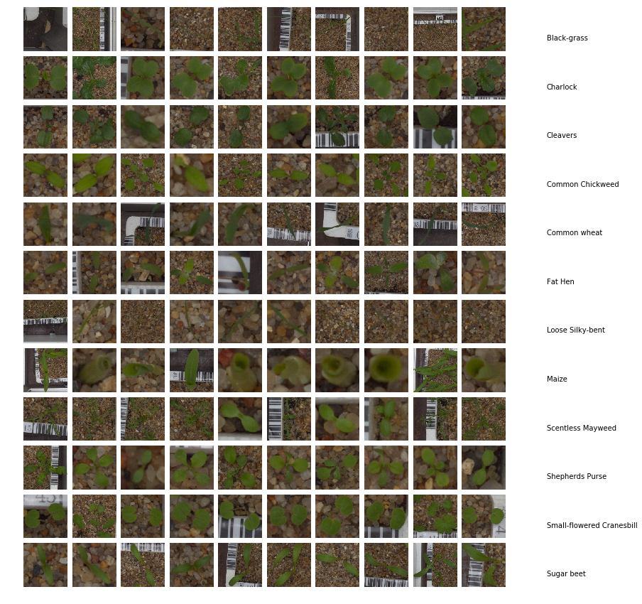

# Kaggle Plant Seedlings Classification
My attempts to solve the plant seedlings dataset hosted on [Kaggle](https://www.kaggle.com/c/plant-seedlings-classification). The goal is to classify images of 960 uniques plants to 12 species at several growth stage. Two attempts were made, one using Logistic Regression and the second one using Convolutional Neural Network specifically ResNet.  

  

## Logistic Regression
Using the imagenet pretrained weights, the InceptionV3 and ResNet50 architectures are used to extract features from the images. Grid search is used to search for the hyperparameters of the logistic regression model. The ResNet50 features are more discriminative as the model can perform better using the ResNet50 features (~90% accuracy).

## ResNet
A "smaller" ResNet model is implemented using Keras, based heavily on @pyimagesearch's implementation. Several numbers of filters and layers were attempted, the notebook presents the model with the best score. The linear learning rate decay allows the model to train longer with performance improvements without overfitting. This model outperforms the logistic regression model (~97% accuracy).

The last notebook is an attempt to ensemble two of the best ResNet model trained into a soft-voting classifier.  

---

These attempts were done purely based on trial-and-errors without any in-depth research, feel free to suggest any improvements.

---

### Environment
* Python 3.6
* OpenCV 3.4.1
* Tensorflow 1.8.0 GPU
* Keras 2.1.6
